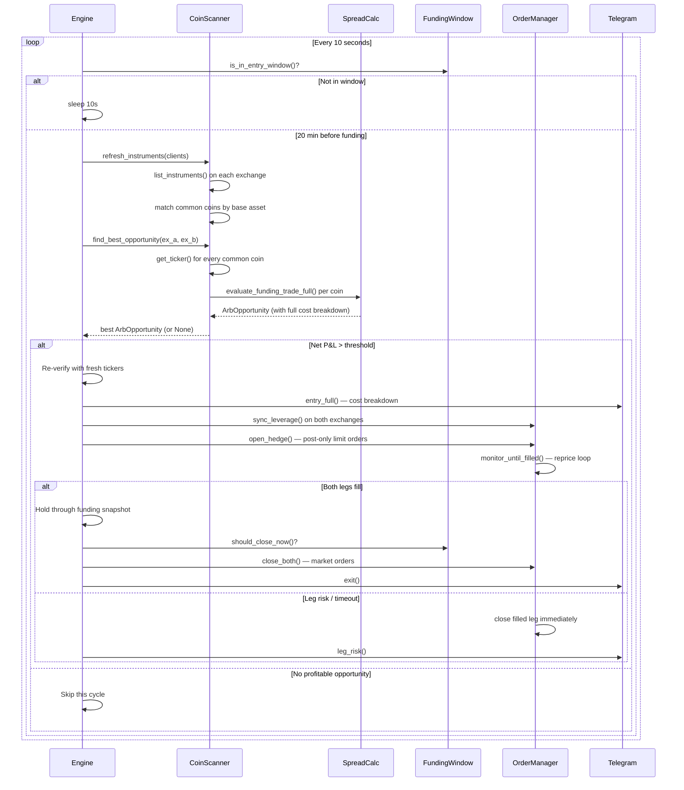

# Architecture

## Overview

The funding arbitrage bot exploits funding rate differentials across Indian
crypto exchanges. When one exchange charges a higher funding rate than another
for the same coin, the bot goes **short on the high-funding exchange** (to
collect) and **long on the low-funding exchange** (as a hedge), holding through
the funding snapshot, then closing.

## System Architecture

```
┌─────────────────────────────────────────────────────────────────┐
│                    run_dummy.py / run_live.py                   │
│            Build exchange clients, configure engines            │
└──────────────────────────┬──────────────────────────────────────┘
                           │
                           ▼
┌─────────────────────────────────────────────────────────────────┐
│                      MultiPairRunner                            │
│          asyncio.gather() — 3 concurrent engines                │
│                                                                 │
│  ┌─────────────────┐ ┌─────────────────┐ ┌─────────────────┐   │
│  │  Engine          │ │  Engine          │ │  Engine          │  │
│  │  shark↔coinswitch│ │  coinswitch↔delta│ │  delta↔shark    │  │
│  └────────┬─────────┘ └────────┬────────┘ └────────┬────────┘  │
└───────────┼─────────────────────┼───────────────────┼───────────┘
            │                     │                   │
            ▼                     ▼                   ▼
┌─────────────────────────────────────────────────────────────────┐
│                    FundingArbEngine (per pair)                   │
│                                                                 │
│  ┌──────────────┐    ┌──────────────┐    ┌──────────────┐       │
│  │ CoinScanner  │───▶│ SpreadCalc   │───▶│ OrderManager │       │
│  │              │    │ (full cost)  │    │ (dual-leg)   │       │
│  │ • discover   │    │              │    │              │       │
│  │ • match      │    │ • funding    │    │ • post-only  │       │
│  │ • rank       │    │ • fees+GST   │    │ • reprice    │       │
│  │              │    │ • spread     │    │ • leg risk   │       │
│  │              │    │ • slippage   │    │ • basis drift│       │
│  └──────────────┘    └──────────────┘    └──────────────┘       │
│                                                                 │
│  ┌──────────────┐    ┌──────────────┐    ┌──────────────┐       │
│  │ FundingWindow│    │ LeverageSync │    │  Telegram    │       │
│  │ • entry lead │    │ • common lev │    │ • entries    │       │
│  │ • close after│    │ • both exch  │    │ • scans      │       │
│  └──────────────┘    └──────────────┘    └──────────────┘       │
└─────────────────────────────┬───────────────────────────────────┘
                              │
                              ▼
┌─────────────────────────────────────────────────────────────────┐
│                    ExchangeClient (interface)                    │
│                                                                 │
│  ┌──────────┐  ┌──────────────┐  ┌──────────┐  ┌───────────┐   │
│  │  Delta   │  │  CoinSwitch  │  │  Shark   │  │ Simulator │   │
│  │  Client  │  │   Client     │  │  Client  │  │  Client   │   │
│  └──────────┘  └──────────────┘  └──────────┘  └───────────┘   │
└─────────────────────────────────────────────────────────────────┘
```

## Data Flow — One Funding Cycle



## Module Responsibilities

| Module | File | Responsibility |
|--------|------|---------------|
| **CoinScanner** | `core/coin_scanner.py` | Discover instruments on each exchange, normalize base assets, match across exchanges, scan funding rates, rank opportunities |
| **SpreadCalc** | `core/spread_calc.py` | Full cost model: funding income/expense, fees+GST, bid/ask spread, slippage. Returns go/no-go verdict |
| **OrderManager** | `core/order_manager.py` | Dual-leg post-only order placement, synchronized repricing every 10s, leg-risk kill-switch, basis-drift kill-switch |
| **FundingWindow** | `core/funding_window.py` | Determine entry/exit windows relative to funding snapshot times (05:30/13:30/21:30 IST) |
| **LeverageSync** | `core/leverage_sync.py` | Set leverage on both exchanges to the minimum both will accept |
| **PriceFeed** | `core/price_feed.py` | Background polling (REST) and WebSocket feeds for real-time ticker data |
| **TelegramNotifier** | `core/telegram_notify.py` | Formatted Telegram messages for entries, exits, scans, errors, heartbeats |

## Exchange Client Interface

Every exchange client (real or simulated) implements the `ExchangeClient` ABC:

```python
class ExchangeClient(ABC):
    def get_ticker(symbol) -> Ticker           # bid/ask/mark/funding
    def list_instruments() -> List[InstrumentInfo]  # all perp futures
    def set_leverage(symbol, leverage) -> int   # returns actual applied
    def place_limit_order(symbol, side, price, qty) -> OrderResult
    def cancel_order(symbol, order_id) -> bool
    def get_order_status(symbol, order_id) -> OrderResult
    def get_position(symbol) -> Position
    def close_position_market(symbol) -> OrderResult
```

The engine NEVER imports a specific client class — it only talks through this
interface. Swapping between `DeltaClient` and `SimulatedClient(DeltaClient)`
requires zero code changes in `engine.py`.

## Exchange Auth Schemes

| Exchange | Auth Method | Signature |
|----------|------------|-----------|
| **Delta** | HMAC-SHA256 | `METHOD + TIMESTAMP + PATH + QUERY + BODY` |
| **CoinSwitch** | Ed25519 | `METHOD + path_decoded + EPOCH` |
| **Shark** | HMAC-SHA256 | GET: query string; POST: `json.dumps(body, separators=(',',':'))` |
